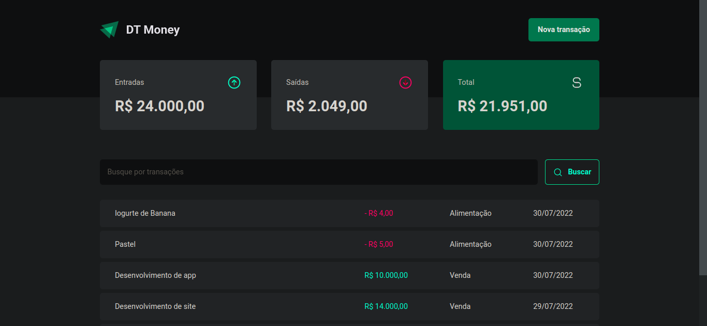

<div align="center">

  <h1>Fundamentos ReacJS</h1>
  <p>
    Rocketseat · Formação Ignite · 2022
  </p>

<!-- Badges -->
<p>

</p>

<h4>
    <a href="https://rs-ignite-03-money.vercel.app/" target="_blank" >Demo</a>
  <span> · </span>
    <a href="https://www.figma.com/community/file/1138814493269096792">Figma</a>
</h4>
</div>

<br />

## 💡 Projeto

Projeto completo baseado no design definido no figma, aplicação de gerenciamento financeiro,usando conceitos de conexão com API, fetching de dados, otimização de performance, fluxo de renderização dos componentes.

---

## 🎯 Objetivos

Por meio deste projeto, foi possível aprender os fundamentos do ReactJS, como:

- [x] Criar uma aplicação do zero com Vite
- [x] Typescript
- [x] Styled Components
- [x] Server mocked
- [x] Fetching
- [x] Performance - useCallback, useMemo, memo

## 🥳 Aplicação

### Preview · [DEMO](https://rs-ignite-03-money.vercel.app/)

<p align="center">
  
</p>

## 💻 Feito com

[](https://developer.mozilla.org/pt-BR/docs/Web/JavaScript)
[](https://www.typescriptlang.org/)
[](https://pt-br.reactjs.org/)
[](https://developer.mozilla.org/pt-BR/docs/Web/CSS)
[](https://vitejs.dev/)
[](https://vercel.com/)

## 🛠️ Ferramentas

[](https://www.figma.com/)
[](https://code.visualstudio.com/)
[](https://pop.system76.com/)

## 🦸‍♂️ Tecnologias de suporte

- [Styled Components](https://styled-components.com/)
- [Zod](https://zod.dev/)
- [Axios](https://axios-http.com/)
- [React Hook Form](https://react-hook-form.com/)
- [Radix UI](https://www.radix-ui.com/)
- [Phosphor Icons](https://phosphoricons.com/)
- [Use Context Seletor](https://github.com/dai-shi/use-context-selector)

## 🚀 Execute o projeto

Clone o projeto

Vá para a raiz do diretório

Instale as dependências

```bash
  pnpm install
```

Inicie o servidor de desenvolvimento

```bash
  pnpm run dev:server
```

Inicie o ambiente de desenvolvimento

```bash
  pnpm run dev
```

<p align="center">Copyright 2022 ☕<a href="https://github.com/laripeanuts"> laripeanuts</a></p>
